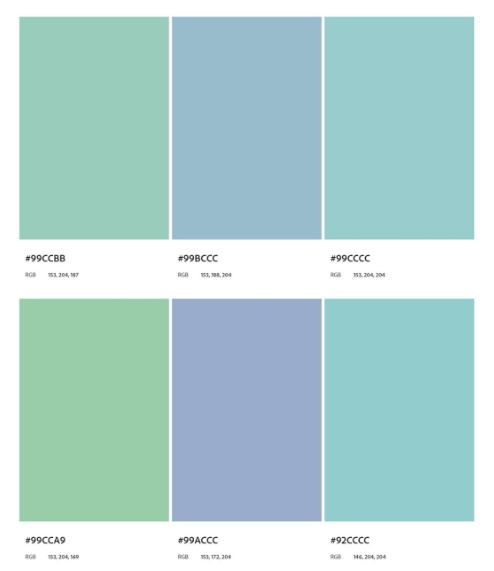
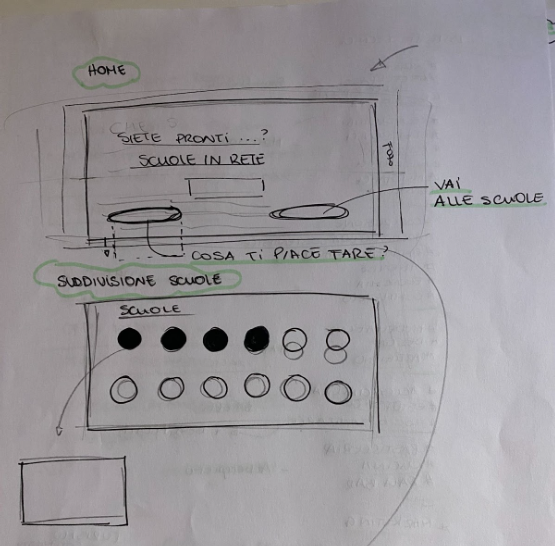
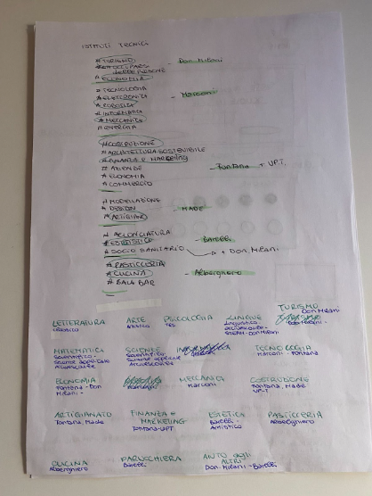

# Progetto Scuole in Rete - Marconi & Depero

## Titolo del progetto: 
### **Superiori veloci**

## Componenti del gruppo: 
- Sebastiano Armanini
- Andrea Galassi
- Giorgia Mattei
- Leonardo Sparano

## Motivazioni progettuali (perché si è scelto un particolare template, colori, font, immagini ecc):
L’intento era quello di creare un sito web semplice, che non infastidisse in alcun modo il visitatore adulto o ragazzo che sia e che potesse permettere una comprensione facile e piacevole del sito. Per questo motivo come colore abbiamo scelto l’azzurro che trasmette tranquillità e permette una buona leggibilità del testo. Inoltre esso è stato organizzato in modo tale da renderlo sia formale che ordinato, per far sì che i ragazzi che andranno a scegliere la scuola lo facciano senza timore. 

## Tecnologie utilizzate: spiegare il perché si sono scelti i framework/linguaggi utilizzati:
Abbiamo utilizzato javascript per la semplicità e l'efficacia del linguaggio, gestendo le richieste direttamente dal file di script.

## Immagine con la palette dei colori utilizzati:

## Descrizione dei font utilizzati:
Questo font, come il colore, è stato scelto per una chiarezza compositiva e per una facile comprensione del sito web. Inoltre l’assenza di grazie permette al lettore di percepire il sito web più semplice ed efficace nella navigabilità. 

## Immagini del progetto grafico:

 

## Screenshot delle pagine principali del progetto in esecuzione:

## Elenco delle istruzioni da eseguire per mandare in esecuzione il progetto consegnato:

1. scaricare il progetto
2. aprire il progetto con l’editor desiderato
3. entrare nella cartella database-scuole con la bash
4. installare Node Package Manager con il comando ‘npm i’ 
5. attivare il database con il comando ‘npm start’
6. aprire il file index.html

**NB**: se le richieste vengono bloccate dal CORS, bisogna rendere pubblica la porta 1337, ovvero quella su cui è collegato il database.
 
## URL del repository GitHub o GitLab creato per il progetto:
[Link del repository](https://github.com/aGal00/Scuole-in-rete)
